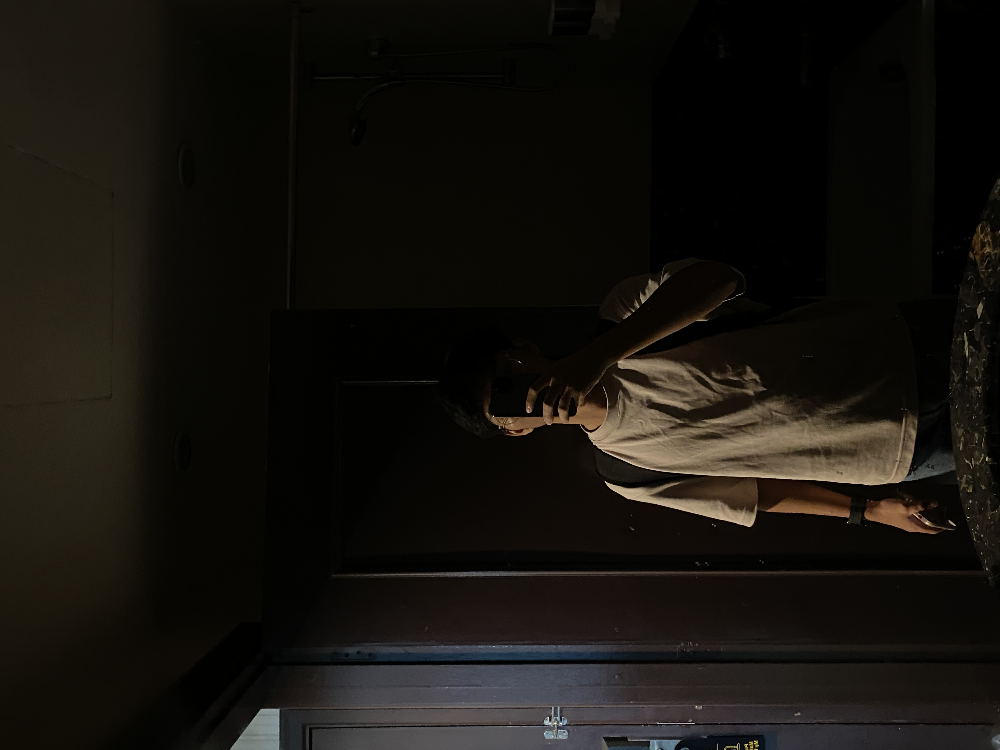

<h1 align="center">Hi there 👋, I'm Wan Muhammad Aniq Irfan Wan Mohd Lutpi</h1>

  

---

### 👨‍💻 About Me

- 👀 I’m interested in **Software Development**, **Mobile Apps**, and **Cybersecurity**
- 🌱 I’m currently learning **Flutter**, **Firebase**, and **Laravel**
- 💞️ I’m looking to collaborate on **Open Source Projects** and **Student Tech Communities**
- 📫 How to reach me:  
  
- 😄 Pronouns: **He/Him**
- ⚡ Fun fact: *I can write code faster with lo-fi music in the background 🎧*

---

### 🛠️ Tech Stack

  <!-- Frontend -->
  
  
  
  
  
  
  
  <!-- Backend -->
  
  
  
  
  

  <!-- Database & Cloud -->
  
  
  
  
  <!-- Tools & Others -->
  
  
  
  

---

### 📈 GitHub Stats

  
  

---

### ✨ Let's Connect

  
  

---

<!---
aniqbinlutpi/aniqbinlutpi is a ✨ special ✨ repository because its `README.md` (this file) appears on your GitHub profile.
You can click the Preview link to take a look at your changes.
--->
